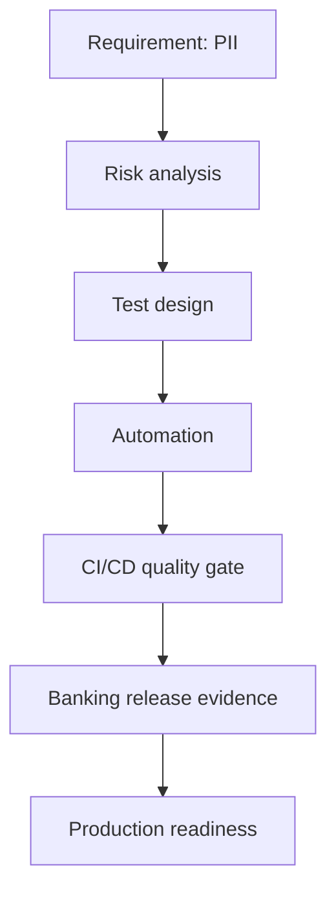
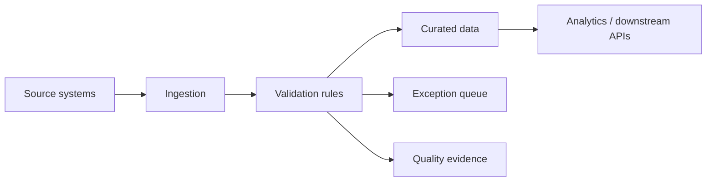
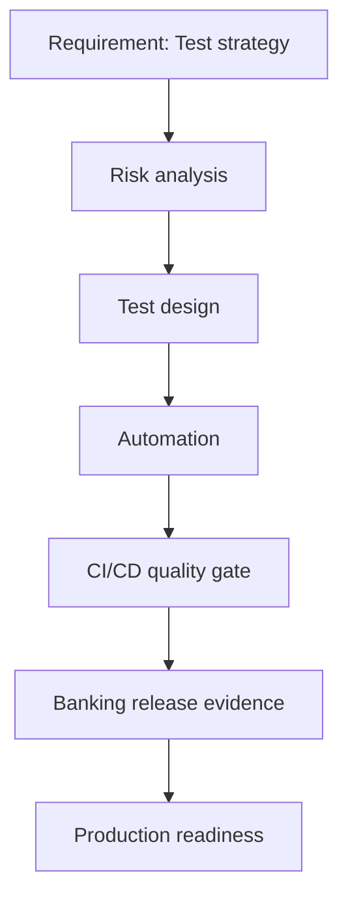
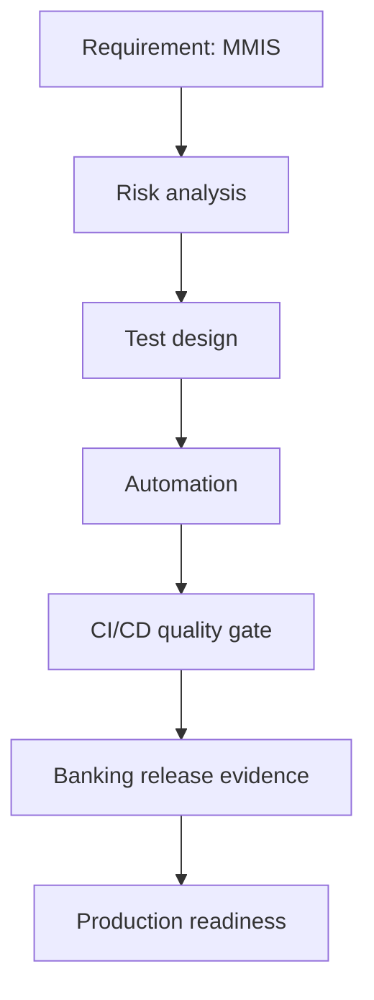
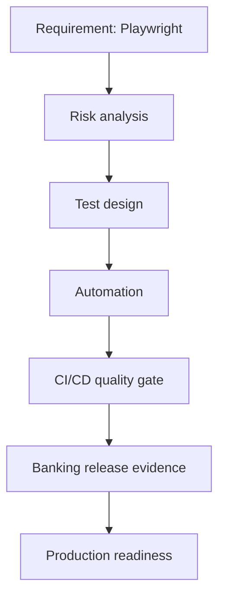
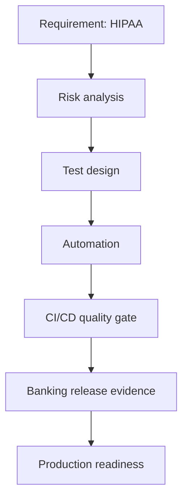
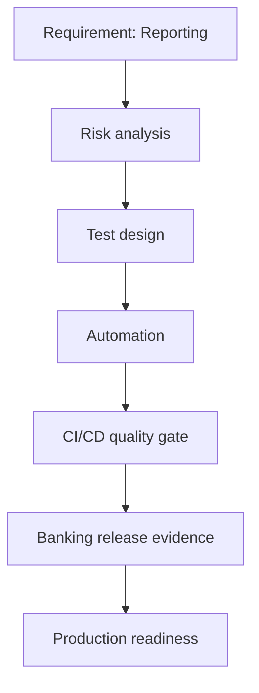
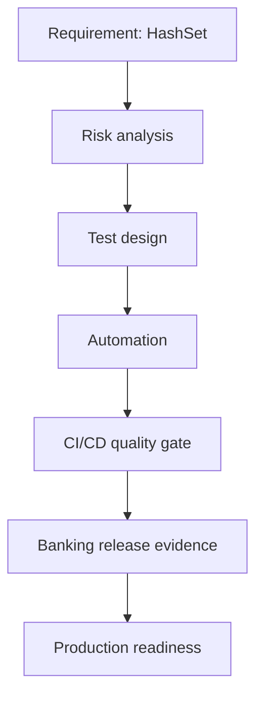

# v4 Content Factory

The Content Factory enriches catalog questions with stronger model answers, validation strategy, evidence expectations, coding prompts, whiteboard prompts, and Mermaid diagrams.

## Summary

- Enriched items: **28**
- Average quality score: **100.0/100**
- Selected rows: **28**

## Category coverage

- **CI_CD_DEVOPS**: 1
- **DATA_ENGINEERING**: 4
- **FRAMEWORK_ARCHITECTURE**: 2
- **HEALTHCARE_PAYER**: 1
- **JAVA_STRINGS**: 6
- **PERFORMANCE_RELIABILITY**: 2
- **RETAIL_SUPPLY_CHAIN**: 3
- **SECURITY_PRIVACY**: 5
- **UI_AUTOMATION**: 3
- **WHITEBOARD_ARCHITECTURE**: 1

## Sample enriched content

### SEC-00843 — PII for Banking observability and production readiness

- Domain: Banking
- Role: Lead Quality Engineer
- Difficulty: Hard
- Quality score: 100/100

Explain and defend a production-ready PII strategy for Banking as a Lead Quality Engineer.

#### Model answer excerpt

I would start by clarifying the business workflow, data grain, upstream/downstream systems, and release risk for PII in a Banking account onboarding scenario. Because this is a hard Lead Quality Engineer interview problem, I would show lead-level ownership, cross-team coordination, automation strategy, risk-based prioritization, and release evidence.

My solution would focus on data protection, least privilege, auditability, masking, encryption, retention, consent, and regulatory evidence. I would define the acceptance criteria first, map them to testable controls, and separate validation into unit/component, API or integration, data, security, performance, and UAT evidence. For automation, I would create reusable checks that run in CI/CD, tag tests by risk and domain, and publish results with traceable evidence.

For production readiness, I would require clear pass/fail gates, defect tr...

#### Diagram

### ETL-01085 — CDC validation for Banking cloud migration

- Domain: Banking
- Role: Lead Quality Engineer
- Difficulty: Hard
- Quality score: 100/100

Explain and defend a production-ready CDC validation strategy for Banking as a Lead Quality Engineer.

#### Model answer excerpt

I would start by clarifying the business workflow, data grain, upstream/downstream systems, and release risk for CDC validation in a Banking account onboarding scenario. Because this is a hard Lead Quality Engineer interview problem, I would show lead-level ownership, cross-team coordination, automation strategy, risk-based prioritization, and release evidence.

My solution would focus on source-to-target validation, reconciliation, schema drift, data quality rules, lineage, and recoverability. I would define the acceptance criteria first, map them to testable controls, and separate validation into unit/component, API or integration, data, security, performance, and UAT evidence. For automation, I would create reusable checks that run in CI/CD, tag tests by risk and domain, and publish results with traceable evidence.

For production readiness, I would require clear pass/fail gates, defe...

#### Diagram

### WHI-02735 — Test strategy for Banking high-volume transaction validation

- Domain: Banking
- Role: Lead Quality Engineer
- Difficulty: Hard
- Quality score: 100/100

Explain and defend a production-ready Test strategy strategy for Banking as a Lead Quality Engineer.

#### Model answer excerpt

I would start by clarifying the business workflow, data grain, upstream/downstream systems, and release risk for Test strategy in a Banking account onboarding scenario. Because this is a hard Lead Quality Engineer interview problem, I would show lead-level ownership, cross-team coordination, automation strategy, risk-based prioritization, and release evidence.

My solution would focus on requirements clarity, risk-based testing, automation design, observability, evidence, and production readiness. I would define the acceptance criteria first, map them to testable controls, and separate validation into unit/component, API or integration, data, security, performance, and UAT evidence. For automation, I would create reusable checks that run in CI/CD, tag tests by risk and domain, and publish results with traceable evidence.

For production readiness, I would require clear pass/fail gates, d...

#### Diagram

### HEA-03431 — MMIS for Banking CI/CD quality gate adoption

- Domain: Banking
- Role: Lead Quality Engineer
- Difficulty: Hard
- Quality score: 100/100

Explain and defend a production-ready MMIS strategy for Banking as a Lead Quality Engineer.

#### Model answer excerpt

I would start by clarifying the business workflow, data grain, upstream/downstream systems, and release risk for MMIS in a Banking account onboarding scenario. Because this is a hard Lead Quality Engineer interview problem, I would show lead-level ownership, cross-team coordination, automation strategy, risk-based prioritization, and release evidence.

My solution would focus on requirements clarity, risk-based testing, automation design, observability, evidence, and production readiness. I would define the acceptance criteria first, map them to testable controls, and separate validation into unit/component, API or integration, data, security, performance, and UAT evidence. For automation, I would create reusable checks that run in CI/CD, tag tests by risk and domain, and publish results with traceable evidence.

For production readiness, I would require clear pass/fail gates, defect tri...

#### Diagram

### UI_-03463 — Playwright for Banking regulatory reporting modernization

- Domain: Banking
- Role: Lead Quality Engineer
- Difficulty: Hard
- Quality score: 100/100

Explain and defend a production-ready Playwright strategy for Banking as a Lead Quality Engineer.

#### Model answer excerpt

I would start by clarifying the business workflow, data grain, upstream/downstream systems, and release risk for Playwright in a Banking account onboarding scenario. Because this is a hard Lead Quality Engineer interview problem, I would show lead-level ownership, cross-team coordination, automation strategy, risk-based prioritization, and release evidence.

My solution would focus on requirements clarity, risk-based testing, automation design, observability, evidence, and production readiness. I would define the acceptance criteria first, map them to testable controls, and separate validation into unit/component, API or integration, data, security, performance, and UAT evidence. For automation, I would create reusable checks that run in CI/CD, tag tests by risk and domain, and publish results with traceable evidence.

For production readiness, I would require clear pass/fail gates, defe...

#### Diagram

### SEC-03525 — HIPAA for Banking cloud migration

- Domain: Banking
- Role: Lead Quality Engineer
- Difficulty: Hard
- Quality score: 100/100

Explain and defend a production-ready HIPAA strategy for Banking as a Lead Quality Engineer.

#### Model answer excerpt

I would start by clarifying the business workflow, data grain, upstream/downstream systems, and release risk for HIPAA in a Banking account onboarding scenario. Because this is a hard Lead Quality Engineer interview problem, I would show lead-level ownership, cross-team coordination, automation strategy, risk-based prioritization, and release evidence.

My solution would focus on data protection, least privilege, auditability, masking, encryption, retention, consent, and regulatory evidence. I would define the acceptance criteria first, map them to testable controls, and separate validation into unit/component, API or integration, data, security, performance, and UAT evidence. For automation, I would create reusable checks that run in CI/CD, tag tests by risk and domain, and publish results with traceable evidence.

For production readiness, I would require clear pass/fail gates, defect ...

#### Diagram

### SEC-03867 — PII for Banking data governance program

- Domain: Banking
- Role: Lead Quality Engineer
- Difficulty: Hard
- Quality score: 100/100

Explain and defend a production-ready PII strategy for Banking as a Lead Quality Engineer.

#### Model answer excerpt

I would start by clarifying the business workflow, data grain, upstream/downstream systems, and release risk for PII in a Banking account onboarding scenario. Because this is a hard Lead Quality Engineer interview problem, I would show lead-level ownership, cross-team coordination, automation strategy, risk-based prioritization, and release evidence.

My solution would focus on data protection, least privilege, auditability, masking, encryption, retention, consent, and regulatory evidence. I would define the acceptance criteria first, map them to testable controls, and separate validation into unit/component, API or integration, data, security, performance, and UAT evidence. For automation, I would create reusable checks that run in CI/CD, tag tests by risk and domain, and publish results with traceable evidence.

For production readiness, I would require clear pass/fail gates, defect tr...

#### Diagram

### FRA-03878 — Reporting for Banking data platform migration

- Domain: Banking
- Role: Lead Quality Engineer
- Difficulty: Hard
- Quality score: 100/100

Explain and defend a production-ready Reporting strategy for Banking as a Lead Quality Engineer.

#### Model answer excerpt

I would start by clarifying the business workflow, data grain, upstream/downstream systems, and release risk for Reporting in a Banking account onboarding scenario. Because this is a hard Lead Quality Engineer interview problem, I would show lead-level ownership, cross-team coordination, automation strategy, risk-based prioritization, and release evidence.

My solution would focus on requirements clarity, risk-based testing, automation design, observability, evidence, and production readiness. I would define the acceptance criteria first, map them to testable controls, and separate validation into unit/component, API or integration, data, security, performance, and UAT evidence. For automation, I would create reusable checks that run in CI/CD, tag tests by risk and domain, and publish results with traceable evidence.

For production readiness, I would require clear pass/fail gates, defec...

#### Diagram

### JAV-03925 — HashSet for Banking test automation modernization

- Domain: Banking
- Role: Lead Quality Engineer
- Difficulty: Hard
- Quality score: 100/100

Explain and defend a production-ready HashSet strategy for Banking as a Lead Quality Engineer.

#### Model answer excerpt

I would start by clarifying the business workflow, data grain, upstream/downstream systems, and release risk for HashSet in a Banking account onboarding scenario. Because this is a hard Lead Quality Engineer interview problem, I would show lead-level ownership, cross-team coordination, automation strategy, risk-based prioritization, and release evidence.

My solution would focus on input normalization, null safety, encoding, validation rules, boundary tests, internationalization, and maintainable utilities. I would define the acceptance criteria first, map them to testable controls, and separate validation into unit/component, API or integration, data, security, performance, and UAT evidence. For automation, I would create reusable checks that run in CI/CD, tag tests by risk and domain, and publish results with traceable evidence.

For production readiness, I would require clear pass/fai...

#### Diagram

### SQL-04900 — Joins for Banking enterprise modernization

- Domain: Banking
- Role: Lead Quality Engineer
- Difficulty: Hard
- Quality score: 100/100

Explain and defend a production-ready Joins strategy for Banking as a Lead Quality Engineer.

#### Model answer excerpt

I would start by clarifying the business workflow, data grain, upstream/downstream systems, and release risk for Joins in a Banking account onboarding scenario. Because this is a hard Lead Quality Engineer interview problem, I would show lead-level ownership, cross-team coordination, automation strategy, risk-based prioritization, and release evidence.

My solution would focus on source-to-target validation, reconciliation, schema drift, data quality rules, lineage, and recoverability. I would define the acceptance criteria first, map them to testable controls, and separate validation into unit/component, API or integration, data, security, performance, and UAT evidence. For automation, I would create reusable checks that run in CI/CD, tag tests by risk and domain, and publish results with traceable evidence.

For production readiness, I would require clear pass/fail gates, defect triage...

#### Diagram

