# Enterprise QE Academy v4 Content Factory

Generated enriched content items: **28**

## SEC-00843 — PII for Banking observability and production readiness

- Domain: Banking
- Role: Lead Quality Engineer
- Difficulty: Hard
- Category: SECURITY_PRIVACY
- Concept: PII
- Quality score: 100/100

### Learning objective

Explain and defend a production-ready PII strategy for Banking as a Lead Quality Engineer.

### Model answer

I would start by clarifying the business workflow, data grain, upstream/downstream systems, and release risk for PII in a Banking account onboarding scenario. Because this is a hard Lead Quality Engineer interview problem, I would show lead-level ownership, cross-team coordination, automation strategy, risk-based prioritization, and release evidence.

My solution would focus on data protection, least privilege, auditability, masking, encryption, retention, consent, and regulatory evidence. I would define the acceptance criteria first, map them to testable controls, and separate validation into unit/component, API or integration, data, security, performance, and UAT evidence. For automation, I would create reusable checks that run in CI/CD, tag tests by risk and domain, and publish results with traceable evidence.

For production readiness, I would require clear pass/fail gates, defect triage rules, rollback criteria, monitoring dashboards, log/trace correlation, and sign-off from engineering, product, security, and business stakeholders where applicable. The key is not only proving that the happy path works, but proving that edge cases, failure behavior, auditability, and operational recovery are controlled.

### Validation strategy

- Clarify acceptance criteria and map each requirement to executable tests.
- Cover happy path, negative path, boundary conditions, failure modes, and regression impact.
- Automate repeatable checks and publish results as CI/CD quality-gate evidence.
- Validate observability with logs, metrics, traces, dashboards, and alert thresholds.
- Confirm release readiness with traceability, defect disposition, rollback criteria, and stakeholder sign-off.

### Evidence expected

- masked data screenshots
- access-control matrix
- audit log samples
- negative authorization tests
- encryption validation evidence

### Follow-up questions

- How would you automate this without making the suite brittle?
- What would you include in release-readiness evidence?
- How would you test failure behavior and recovery?
- Which risks would you escalate before go-live?
- How would you explain the result to a non-technical stakeholder?

### Whiteboard diagram

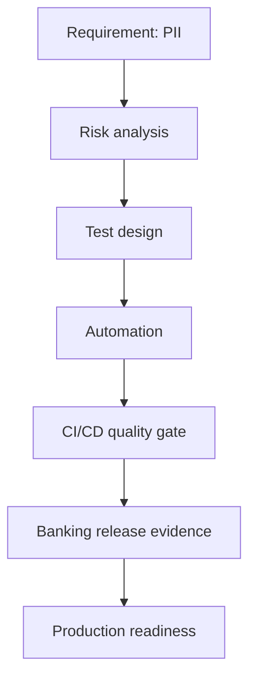

## ETL-01085 — CDC validation for Banking cloud migration

- Domain: Banking
- Role: Lead Quality Engineer
- Difficulty: Hard
- Category: DATA_ENGINEERING
- Concept: CDC validation
- Quality score: 100/100

### Learning objective

Explain and defend a production-ready CDC validation strategy for Banking as a Lead Quality Engineer.

### Model answer

I would start by clarifying the business workflow, data grain, upstream/downstream systems, and release risk for CDC validation in a Banking account onboarding scenario. Because this is a hard Lead Quality Engineer interview problem, I would show lead-level ownership, cross-team coordination, automation strategy, risk-based prioritization, and release evidence.

My solution would focus on source-to-target validation, reconciliation, schema drift, data quality rules, lineage, and recoverability. I would define the acceptance criteria first, map them to testable controls, and separate validation into unit/component, API or integration, data, security, performance, and UAT evidence. For automation, I would create reusable checks that run in CI/CD, tag tests by risk and domain, and publish results with traceable evidence.

For production readiness, I would require clear pass/fail gates, defect triage rules, rollback criteria, monitoring dashboards, log/trace correlation, and sign-off from engineering, product, security, and business stakeholders where applicable. The key is not only proving that the happy path works, but proving that edge cases, failure behavior, auditability, and operational recovery are controlled.

### Validation strategy

- Clarify acceptance criteria and map each requirement to executable tests.
- Cover happy path, negative path, boundary conditions, failure modes, and regression impact.
- Automate repeatable checks and publish results as CI/CD quality-gate evidence.
- Validate observability with logs, metrics, traces, dashboards, and alert thresholds.
- Confirm release readiness with traceability, defect disposition, rollback criteria, and stakeholder sign-off.

### Evidence expected

- reconciliation report
- DQ rule results
- lineage proof
- exception queue
- rerun validation

### Follow-up questions

- How would you automate this without making the suite brittle?
- What would you include in release-readiness evidence?
- How would you test failure behavior and recovery?
- Which risks would you escalate before go-live?
- How would you explain the result to a non-technical stakeholder?

### Whiteboard diagram

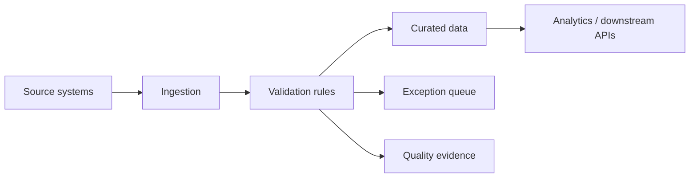

## WHI-02735 — Test strategy for Banking high-volume transaction validation

- Domain: Banking
- Role: Lead Quality Engineer
- Difficulty: Hard
- Category: WHITEBOARD_ARCHITECTURE
- Concept: Test strategy
- Quality score: 100/100

### Learning objective

Explain and defend a production-ready Test strategy strategy for Banking as a Lead Quality Engineer.

### Model answer

I would start by clarifying the business workflow, data grain, upstream/downstream systems, and release risk for Test strategy in a Banking account onboarding scenario. Because this is a hard Lead Quality Engineer interview problem, I would show lead-level ownership, cross-team coordination, automation strategy, risk-based prioritization, and release evidence.

My solution would focus on requirements clarity, risk-based testing, automation design, observability, evidence, and production readiness. I would define the acceptance criteria first, map them to testable controls, and separate validation into unit/component, API or integration, data, security, performance, and UAT evidence. For automation, I would create reusable checks that run in CI/CD, tag tests by risk and domain, and publish results with traceable evidence.

For production readiness, I would require clear pass/fail gates, defect triage rules, rollback criteria, monitoring dashboards, log/trace correlation, and sign-off from engineering, product, security, and business stakeholders where applicable. The key is not only proving that the happy path works, but proving that edge cases, failure behavior, auditability, and operational recovery are controlled.

### Validation strategy

- Clarify acceptance criteria and map each requirement to executable tests.
- Cover happy path, negative path, boundary conditions, failure modes, and regression impact.
- Automate repeatable checks and publish results as CI/CD quality-gate evidence.
- Validate observability with logs, metrics, traces, dashboards, and alert thresholds.
- Confirm release readiness with traceability, defect disposition, rollback criteria, and stakeholder sign-off.

### Evidence expected

- test plan
- automation results
- defect summary
- traceability matrix
- release sign-off

### Follow-up questions

- How would you automate this without making the suite brittle?
- What would you include in release-readiness evidence?
- How would you test failure behavior and recovery?
- Which risks would you escalate before go-live?
- How would you explain the result to a non-technical stakeholder?

### Whiteboard diagram

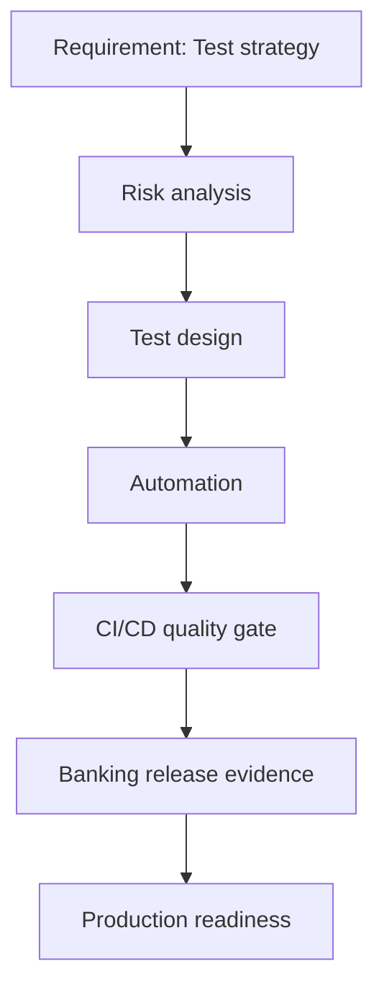

## HEA-03431 — MMIS for Banking CI/CD quality gate adoption

- Domain: Banking
- Role: Lead Quality Engineer
- Difficulty: Hard
- Category: HEALTHCARE_PAYER
- Concept: MMIS
- Quality score: 100/100

### Learning objective

Explain and defend a production-ready MMIS strategy for Banking as a Lead Quality Engineer.

### Model answer

I would start by clarifying the business workflow, data grain, upstream/downstream systems, and release risk for MMIS in a Banking account onboarding scenario. Because this is a hard Lead Quality Engineer interview problem, I would show lead-level ownership, cross-team coordination, automation strategy, risk-based prioritization, and release evidence.

My solution would focus on requirements clarity, risk-based testing, automation design, observability, evidence, and production readiness. I would define the acceptance criteria first, map them to testable controls, and separate validation into unit/component, API or integration, data, security, performance, and UAT evidence. For automation, I would create reusable checks that run in CI/CD, tag tests by risk and domain, and publish results with traceable evidence.

For production readiness, I would require clear pass/fail gates, defect triage rules, rollback criteria, monitoring dashboards, log/trace correlation, and sign-off from engineering, product, security, and business stakeholders where applicable. The key is not only proving that the happy path works, but proving that edge cases, failure behavior, auditability, and operational recovery are controlled.

### Validation strategy

- Clarify acceptance criteria and map each requirement to executable tests.
- Cover happy path, negative path, boundary conditions, failure modes, and regression impact.
- Automate repeatable checks and publish results as CI/CD quality-gate evidence.
- Validate observability with logs, metrics, traces, dashboards, and alert thresholds.
- Confirm release readiness with traceability, defect disposition, rollback criteria, and stakeholder sign-off.

### Evidence expected

- test plan
- automation results
- defect summary
- traceability matrix
- release sign-off

### Follow-up questions

- How would you automate this without making the suite brittle?
- What would you include in release-readiness evidence?
- How would you test failure behavior and recovery?
- Which risks would you escalate before go-live?
- How would you explain the result to a non-technical stakeholder?

### Whiteboard diagram

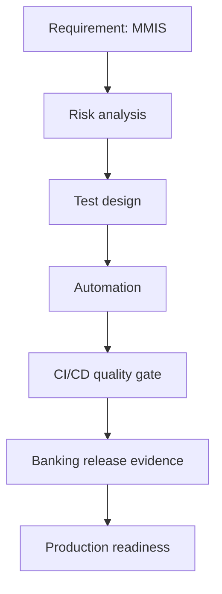

## UI_-03463 — Playwright for Banking regulatory reporting modernization

- Domain: Banking
- Role: Lead Quality Engineer
- Difficulty: Hard
- Category: UI_AUTOMATION
- Concept: Playwright
- Quality score: 100/100

### Learning objective

Explain and defend a production-ready Playwright strategy for Banking as a Lead Quality Engineer.

### Model answer

I would start by clarifying the business workflow, data grain, upstream/downstream systems, and release risk for Playwright in a Banking account onboarding scenario. Because this is a hard Lead Quality Engineer interview problem, I would show lead-level ownership, cross-team coordination, automation strategy, risk-based prioritization, and release evidence.

My solution would focus on requirements clarity, risk-based testing, automation design, observability, evidence, and production readiness. I would define the acceptance criteria first, map them to testable controls, and separate validation into unit/component, API or integration, data, security, performance, and UAT evidence. For automation, I would create reusable checks that run in CI/CD, tag tests by risk and domain, and publish results with traceable evidence.

For production readiness, I would require clear pass/fail gates, defect triage rules, rollback criteria, monitoring dashboards, log/trace correlation, and sign-off from engineering, product, security, and business stakeholders where applicable. The key is not only proving that the happy path works, but proving that edge cases, failure behavior, auditability, and operational recovery are controlled.

### Validation strategy

- Clarify acceptance criteria and map each requirement to executable tests.
- Cover happy path, negative path, boundary conditions, failure modes, and regression impact.
- Automate repeatable checks and publish results as CI/CD quality-gate evidence.
- Validate observability with logs, metrics, traces, dashboards, and alert thresholds.
- Confirm release readiness with traceability, defect disposition, rollback criteria, and stakeholder sign-off.

### Evidence expected

- test plan
- automation results
- defect summary
- traceability matrix
- release sign-off

### Follow-up questions

- How would you automate this without making the suite brittle?
- What would you include in release-readiness evidence?
- How would you test failure behavior and recovery?
- Which risks would you escalate before go-live?
- How would you explain the result to a non-technical stakeholder?

### Whiteboard diagram

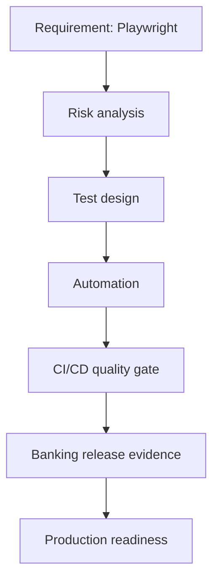

## SEC-03525 — HIPAA for Banking cloud migration

- Domain: Banking
- Role: Lead Quality Engineer
- Difficulty: Hard
- Category: SECURITY_PRIVACY
- Concept: HIPAA
- Quality score: 100/100

### Learning objective

Explain and defend a production-ready HIPAA strategy for Banking as a Lead Quality Engineer.

### Model answer

I would start by clarifying the business workflow, data grain, upstream/downstream systems, and release risk for HIPAA in a Banking account onboarding scenario. Because this is a hard Lead Quality Engineer interview problem, I would show lead-level ownership, cross-team coordination, automation strategy, risk-based prioritization, and release evidence.

My solution would focus on data protection, least privilege, auditability, masking, encryption, retention, consent, and regulatory evidence. I would define the acceptance criteria first, map them to testable controls, and separate validation into unit/component, API or integration, data, security, performance, and UAT evidence. For automation, I would create reusable checks that run in CI/CD, tag tests by risk and domain, and publish results with traceable evidence.

For production readiness, I would require clear pass/fail gates, defect triage rules, rollback criteria, monitoring dashboards, log/trace correlation, and sign-off from engineering, product, security, and business stakeholders where applicable. The key is not only proving that the happy path works, but proving that edge cases, failure behavior, auditability, and operational recovery are controlled.

### Validation strategy

- Clarify acceptance criteria and map each requirement to executable tests.
- Cover happy path, negative path, boundary conditions, failure modes, and regression impact.
- Automate repeatable checks and publish results as CI/CD quality-gate evidence.
- Validate observability with logs, metrics, traces, dashboards, and alert thresholds.
- Confirm release readiness with traceability, defect disposition, rollback criteria, and stakeholder sign-off.

### Evidence expected

- masked data screenshots
- access-control matrix
- audit log samples
- negative authorization tests
- encryption validation evidence

### Follow-up questions

- How would you automate this without making the suite brittle?
- What would you include in release-readiness evidence?
- How would you test failure behavior and recovery?
- Which risks would you escalate before go-live?
- How would you explain the result to a non-technical stakeholder?

### Whiteboard diagram

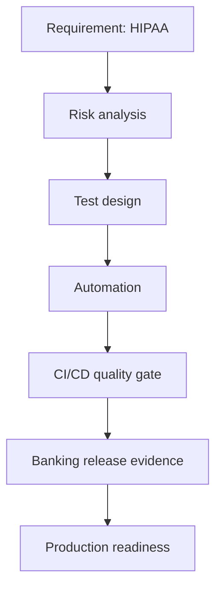

## SEC-03867 — PII for Banking data governance program

- Domain: Banking
- Role: Lead Quality Engineer
- Difficulty: Hard
- Category: SECURITY_PRIVACY
- Concept: PII
- Quality score: 100/100

### Learning objective

Explain and defend a production-ready PII strategy for Banking as a Lead Quality Engineer.

### Model answer

I would start by clarifying the business workflow, data grain, upstream/downstream systems, and release risk for PII in a Banking account onboarding scenario. Because this is a hard Lead Quality Engineer interview problem, I would show lead-level ownership, cross-team coordination, automation strategy, risk-based prioritization, and release evidence.

My solution would focus on data protection, least privilege, auditability, masking, encryption, retention, consent, and regulatory evidence. I would define the acceptance criteria first, map them to testable controls, and separate validation into unit/component, API or integration, data, security, performance, and UAT evidence. For automation, I would create reusable checks that run in CI/CD, tag tests by risk and domain, and publish results with traceable evidence.

For production readiness, I would require clear pass/fail gates, defect triage rules, rollback criteria, monitoring dashboards, log/trace correlation, and sign-off from engineering, product, security, and business stakeholders where applicable. The key is not only proving that the happy path works, but proving that edge cases, failure behavior, auditability, and operational recovery are controlled.

### Validation strategy

- Clarify acceptance criteria and map each requirement to executable tests.
- Cover happy path, negative path, boundary conditions, failure modes, and regression impact.
- Automate repeatable checks and publish results as CI/CD quality-gate evidence.
- Validate observability with logs, metrics, traces, dashboards, and alert thresholds.
- Confirm release readiness with traceability, defect disposition, rollback criteria, and stakeholder sign-off.

### Evidence expected

- masked data screenshots
- access-control matrix
- audit log samples
- negative authorization tests
- encryption validation evidence

### Follow-up questions

- How would you automate this without making the suite brittle?
- What would you include in release-readiness evidence?
- How would you test failure behavior and recovery?
- Which risks would you escalate before go-live?
- How would you explain the result to a non-technical stakeholder?

### Whiteboard diagram


## FRA-03878 — Reporting for Banking data platform migration

- Domain: Banking
- Role: Lead Quality Engineer
- Difficulty: Hard
- Category: FRAMEWORK_ARCHITECTURE
- Concept: Reporting
- Quality score: 100/100

### Learning objective

Explain and defend a production-ready Reporting strategy for Banking as a Lead Quality Engineer.

### Model answer

I would start by clarifying the business workflow, data grain, upstream/downstream systems, and release risk for Reporting in a Banking account onboarding scenario. Because this is a hard Lead Quality Engineer interview problem, I would show lead-level ownership, cross-team coordination, automation strategy, risk-based prioritization, and release evidence.

My solution would focus on requirements clarity, risk-based testing, automation design, observability, evidence, and production readiness. I would define the acceptance criteria first, map them to testable controls, and separate validation into unit/component, API or integration, data, security, performance, and UAT evidence. For automation, I would create reusable checks that run in CI/CD, tag tests by risk and domain, and publish results with traceable evidence.

For production readiness, I would require clear pass/fail gates, defect triage rules, rollback criteria, monitoring dashboards, log/trace correlation, and sign-off from engineering, product, security, and business stakeholders where applicable. The key is not only proving that the happy path works, but proving that edge cases, failure behavior, auditability, and operational recovery are controlled.

### Validation strategy

- Clarify acceptance criteria and map each requirement to executable tests.
- Cover happy path, negative path, boundary conditions, failure modes, and regression impact.
- Automate repeatable checks and publish results as CI/CD quality-gate evidence.
- Validate observability with logs, metrics, traces, dashboards, and alert thresholds.
- Confirm release readiness with traceability, defect disposition, rollback criteria, and stakeholder sign-off.

### Evidence expected

- test plan
- automation results
- defect summary
- traceability matrix
- release sign-off

### Follow-up questions

- How would you automate this without making the suite brittle?
- What would you include in release-readiness evidence?
- How would you test failure behavior and recovery?
- Which risks would you escalate before go-live?
- How would you explain the result to a non-technical stakeholder?

### Whiteboard diagram

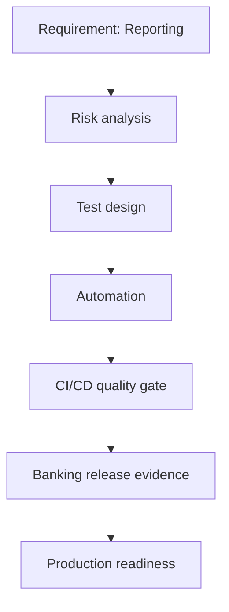

## JAV-03925 — HashSet for Banking test automation modernization

- Domain: Banking
- Role: Lead Quality Engineer
- Difficulty: Hard
- Category: JAVA_STRINGS
- Concept: HashSet
- Quality score: 100/100

### Learning objective

Explain and defend a production-ready HashSet strategy for Banking as a Lead Quality Engineer.

### Model answer

I would start by clarifying the business workflow, data grain, upstream/downstream systems, and release risk for HashSet in a Banking account onboarding scenario. Because this is a hard Lead Quality Engineer interview problem, I would show lead-level ownership, cross-team coordination, automation strategy, risk-based prioritization, and release evidence.

My solution would focus on input normalization, null safety, encoding, validation rules, boundary tests, internationalization, and maintainable utilities. I would define the acceptance criteria first, map them to testable controls, and separate validation into unit/component, API or integration, data, security, performance, and UAT evidence. For automation, I would create reusable checks that run in CI/CD, tag tests by risk and domain, and publish results with traceable evidence.

For production readiness, I would require clear pass/fail gates, defect triage rules, rollback criteria, monitoring dashboards, log/trace correlation, and sign-off from engineering, product, security, and business stakeholders where applicable. The key is not only proving that the happy path works, but proving that edge cases, failure behavior, auditability, and operational recovery are controlled.

### Validation strategy

- Clarify acceptance criteria and map each requirement to executable tests.
- Cover happy path, negative path, boundary conditions, failure modes, and regression impact.
- Automate repeatable checks and publish results as CI/CD quality-gate evidence.
- Validate observability with logs, metrics, traces, dashboards, and alert thresholds.
- Confirm release readiness with traceability, defect disposition, rollback criteria, and stakeholder sign-off.

### Evidence expected

- unit-test matrix
- boundary cases
- code coverage
- static analysis
- complexity notes

### Follow-up questions

- How would you automate this without making the suite brittle?
- What would you include in release-readiness evidence?
- How would you test failure behavior and recovery?
- Which risks would you escalate before go-live?
- How would you explain the result to a non-technical stakeholder?

### Whiteboard diagram

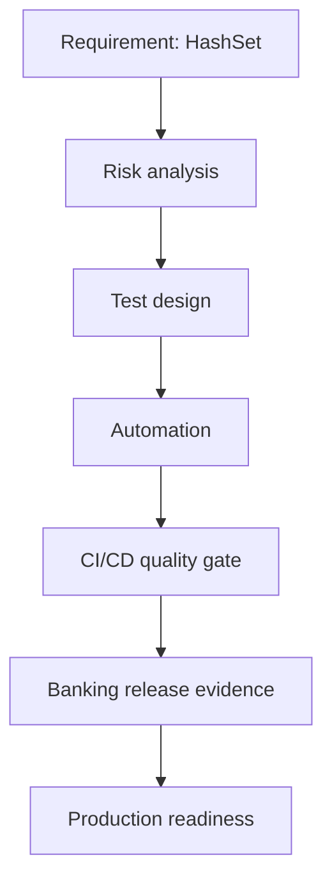

## SQL-04900 — Joins for Banking enterprise modernization

- Domain: Banking
- Role: Lead Quality Engineer
- Difficulty: Hard
- Category: DATA_ENGINEERING
- Concept: Joins
- Quality score: 100/100

### Learning objective

Explain and defend a production-ready Joins strategy for Banking as a Lead Quality Engineer.

### Model answer

I would start by clarifying the business workflow, data grain, upstream/downstream systems, and release risk for Joins in a Banking account onboarding scenario. Because this is a hard Lead Quality Engineer interview problem, I would show lead-level ownership, cross-team coordination, automation strategy, risk-based prioritization, and release evidence.

My solution would focus on source-to-target validation, reconciliation, schema drift, data quality rules, lineage, and recoverability. I would define the acceptance criteria first, map them to testable controls, and separate validation into unit/component, API or integration, data, security, performance, and UAT evidence. For automation, I would create reusable checks that run in CI/CD, tag tests by risk and domain, and publish results with traceable evidence.

For production readiness, I would require clear pass/fail gates, defect triage rules, rollback criteria, monitoring dashboards, log/trace correlation, and sign-off from engineering, product, security, and business stakeholders where applicable. The key is not only proving that the happy path works, but proving that edge cases, failure behavior, auditability, and operational recovery are controlled.

### Validation strategy

- Clarify acceptance criteria and map each requirement to executable tests.
- Cover happy path, negative path, boundary conditions, failure modes, and regression impact.
- Automate repeatable checks and publish results as CI/CD quality-gate evidence.
- Validate observability with logs, metrics, traces, dashboards, and alert thresholds.
- Confirm release readiness with traceability, defect disposition, rollback criteria, and stakeholder sign-off.

### Evidence expected

- reconciliation report
- DQ rule results
- lineage proof
- exception queue
- rerun validation

### Follow-up questions

- How would you automate this without making the suite brittle?
- What would you include in release-readiness evidence?
- How would you test failure behavior and recovery?
- Which risks would you escalate before go-live?
- How would you explain the result to a non-technical stakeholder?

### Whiteboard diagram


## JAV-05024 — Regex validation for Banking CI/CD quality gate adoption

- Domain: Banking
- Role: Lead Quality Engineer
- Difficulty: Hard
- Category: JAVA_STRINGS
- Concept: Regex validation
- Quality score: 100/100

### Learning objective

Explain and defend a production-ready Regex validation strategy for Banking as a Lead Quality Engineer.

### Model answer

I would start by clarifying the business workflow, data grain, upstream/downstream systems, and release risk for Regex validation in a Banking account onboarding scenario. Because this is a hard Lead Quality Engineer interview problem, I would show lead-level ownership, cross-team coordination, automation strategy, risk-based prioritization, and release evidence.

My solution would focus on input normalization, null safety, encoding, validation rules, boundary tests, internationalization, and maintainable utilities. I would define the acceptance criteria first, map them to testable controls, and separate validation into unit/component, API or integration, data, security, performance, and UAT evidence. For automation, I would create reusable checks that run in CI/CD, tag tests by risk and domain, and publish results with traceable evidence.

For production readiness, I would require clear pass/fail gates, defect triage rules, rollback criteria, monitoring dashboards, log/trace correlation, and sign-off from engineering, product, security, and business stakeholders where applicable. The key is not only proving that the happy path works, but proving that edge cases, failure behavior, auditability, and operational recovery are controlled.

### Validation strategy

- Clarify acceptance criteria and map each requirement to executable tests.
- Cover happy path, negative path, boundary conditions, failure modes, and regression impact.
- Automate repeatable checks and publish results as CI/CD quality-gate evidence.
- Validate observability with logs, metrics, traces, dashboards, and alert thresholds.
- Confirm release readiness with traceability, defect disposition, rollback criteria, and stakeholder sign-off.

### Evidence expected

- unit-test matrix
- boundary cases
- code coverage
- static analysis
- complexity notes

### Follow-up questions

- How would you automate this without making the suite brittle?
- What would you include in release-readiness evidence?
- How would you test failure behavior and recovery?
- Which risks would you escalate before go-live?
- How would you explain the result to a non-technical stakeholder?

### Whiteboard diagram

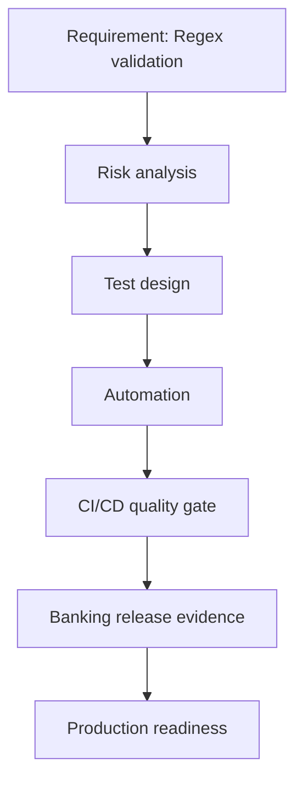

## RET-05646 — Promotions for Banking data governance program

- Domain: Banking
- Role: Lead Quality Engineer
- Difficulty: Hard
- Category: RETAIL_SUPPLY_CHAIN
- Concept: Promotions
- Quality score: 100/100

### Learning objective

Explain and defend a production-ready Promotions strategy for Banking as a Lead Quality Engineer.

### Model answer

I would start by clarifying the business workflow, data grain, upstream/downstream systems, and release risk for Promotions in a Banking account onboarding scenario. Because this is a hard Lead Quality Engineer interview problem, I would show lead-level ownership, cross-team coordination, automation strategy, risk-based prioritization, and release evidence.

My solution would focus on requirements clarity, risk-based testing, automation design, observability, evidence, and production readiness. I would define the acceptance criteria first, map them to testable controls, and separate validation into unit/component, API or integration, data, security, performance, and UAT evidence. For automation, I would create reusable checks that run in CI/CD, tag tests by risk and domain, and publish results with traceable evidence.

For production readiness, I would require clear pass/fail gates, defect triage rules, rollback criteria, monitoring dashboards, log/trace correlation, and sign-off from engineering, product, security, and business stakeholders where applicable. The key is not only proving that the happy path works, but proving that edge cases, failure behavior, auditability, and operational recovery are controlled.

### Validation strategy

- Clarify acceptance criteria and map each requirement to executable tests.
- Cover happy path, negative path, boundary conditions, failure modes, and regression impact.
- Automate repeatable checks and publish results as CI/CD quality-gate evidence.
- Validate observability with logs, metrics, traces, dashboards, and alert thresholds.
- Confirm release readiness with traceability, defect disposition, rollback criteria, and stakeholder sign-off.

### Evidence expected

- test plan
- automation results
- defect summary
- traceability matrix
- release sign-off

### Follow-up questions

- How would you automate this without making the suite brittle?
- What would you include in release-readiness evidence?
- How would you test failure behavior and recovery?
- Which risks would you escalate before go-live?
- How would you explain the result to a non-technical stakeholder?

### Whiteboard diagram

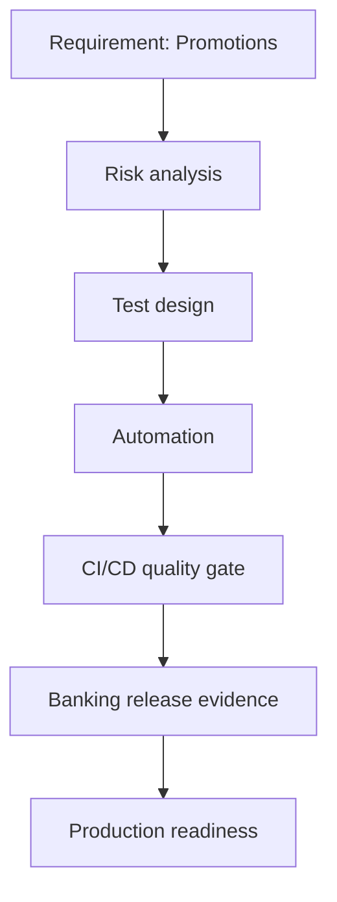

## JAV-05727 — Greedy for Banking data governance program

- Domain: Banking
- Role: Lead Quality Engineer
- Difficulty: Hard
- Category: JAVA_STRINGS
- Concept: Greedy
- Quality score: 100/100

### Learning objective

Explain and defend a production-ready Greedy strategy for Banking as a Lead Quality Engineer.

### Model answer

I would start by clarifying the business workflow, data grain, upstream/downstream systems, and release risk for Greedy in a Banking account onboarding scenario. Because this is a hard Lead Quality Engineer interview problem, I would show lead-level ownership, cross-team coordination, automation strategy, risk-based prioritization, and release evidence.

My solution would focus on input normalization, null safety, encoding, validation rules, boundary tests, internationalization, and maintainable utilities. I would define the acceptance criteria first, map them to testable controls, and separate validation into unit/component, API or integration, data, security, performance, and UAT evidence. For automation, I would create reusable checks that run in CI/CD, tag tests by risk and domain, and publish results with traceable evidence.

For production readiness, I would require clear pass/fail gates, defect triage rules, rollback criteria, monitoring dashboards, log/trace correlation, and sign-off from engineering, product, security, and business stakeholders where applicable. The key is not only proving that the happy path works, but proving that edge cases, failure behavior, auditability, and operational recovery are controlled.

### Validation strategy

- Clarify acceptance criteria and map each requirement to executable tests.
- Cover happy path, negative path, boundary conditions, failure modes, and regression impact.
- Automate repeatable checks and publish results as CI/CD quality-gate evidence.
- Validate observability with logs, metrics, traces, dashboards, and alert thresholds.
- Confirm release readiness with traceability, defect disposition, rollback criteria, and stakeholder sign-off.

### Evidence expected

- unit-test matrix
- boundary cases
- code coverage
- static analysis
- complexity notes

### Follow-up questions

- How would you automate this without making the suite brittle?
- What would you include in release-readiness evidence?
- How would you test failure behavior and recovery?
- Which risks would you escalate before go-live?
- How would you explain the result to a non-technical stakeholder?

### Whiteboard diagram

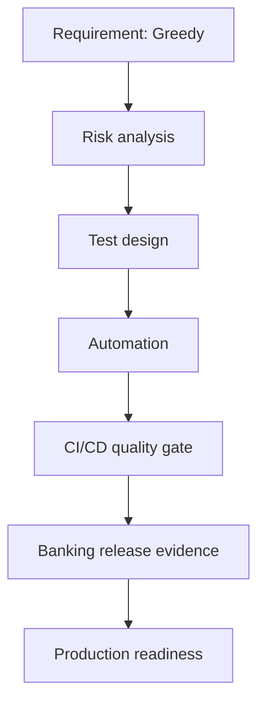

## PER-06062 — LoadRunner for Banking CI/CD quality gate adoption

- Domain: Banking
- Role: Lead Quality Engineer
- Difficulty: Hard
- Category: PERFORMANCE_RELIABILITY
- Concept: LoadRunner
- Quality score: 100/100

### Learning objective

Explain and defend a production-ready LoadRunner strategy for Banking as a Lead Quality Engineer.

### Model answer

I would start by clarifying the business workflow, data grain, upstream/downstream systems, and release risk for LoadRunner in a Banking account onboarding scenario. Because this is a hard Lead Quality Engineer interview problem, I would show lead-level ownership, cross-team coordination, automation strategy, risk-based prioritization, and release evidence.

My solution would focus on SLO/SLA definition, p95/p99 latency, throughput, error budget, saturation, resiliency, failover, and recovery. I would define the acceptance criteria first, map them to testable controls, and separate validation into unit/component, API or integration, data, security, performance, and UAT evidence. For automation, I would create reusable checks that run in CI/CD, tag tests by risk and domain, and publish results with traceable evidence.

For production readiness, I would require clear pass/fail gates, defect triage rules, rollback criteria, monitoring dashboards, log/trace correlation, and sign-off from engineering, product, security, and business stakeholders where applicable. The key is not only proving that the happy path works, but proving that edge cases, failure behavior, auditability, and operational recovery are controlled.

### Validation strategy

- Clarify acceptance criteria and map each requirement to executable tests.
- Cover happy path, negative path, boundary conditions, failure modes, and regression impact.
- Automate repeatable checks and publish results as CI/CD quality-gate evidence.
- Validate observability with logs, metrics, traces, dashboards, and alert thresholds.
- Confirm release readiness with traceability, defect disposition, rollback criteria, and stakeholder sign-off.

### Evidence expected

- load-test report
- latency percentiles
- throughput graph
- APM traces
- capacity recommendation

### Follow-up questions

- How would you automate this without making the suite brittle?
- What would you include in release-readiness evidence?
- How would you test failure behavior and recovery?
- Which risks would you escalate before go-live?
- How would you explain the result to a non-technical stakeholder?

### Whiteboard diagram

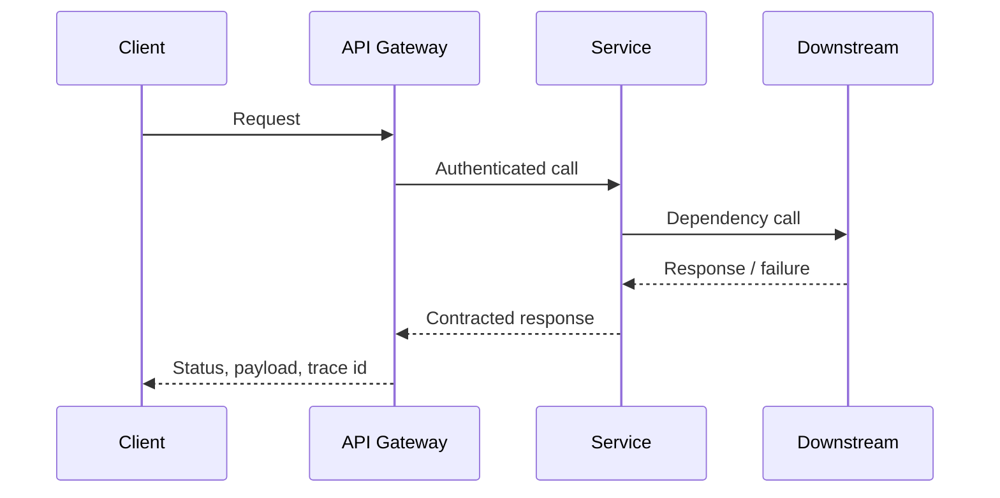

## SEC-06801 — PII for Banking cloud migration

- Domain: Banking
- Role: Lead Quality Engineer
- Difficulty: Hard
- Category: SECURITY_PRIVACY
- Concept: PII
- Quality score: 100/100

### Learning objective

Explain and defend a production-ready PII strategy for Banking as a Lead Quality Engineer.

### Model answer

I would start by clarifying the business workflow, data grain, upstream/downstream systems, and release risk for PII in a Banking account onboarding scenario. Because this is a hard Lead Quality Engineer interview problem, I would show lead-level ownership, cross-team coordination, automation strategy, risk-based prioritization, and release evidence.

My solution would focus on data protection, least privilege, auditability, masking, encryption, retention, consent, and regulatory evidence. I would define the acceptance criteria first, map them to testable controls, and separate validation into unit/component, API or integration, data, security, performance, and UAT evidence. For automation, I would create reusable checks that run in CI/CD, tag tests by risk and domain, and publish results with traceable evidence.

For production readiness, I would require clear pass/fail gates, defect triage rules, rollback criteria, monitoring dashboards, log/trace correlation, and sign-off from engineering, product, security, and business stakeholders where applicable. The key is not only proving that the happy path works, but proving that edge cases, failure behavior, auditability, and operational recovery are controlled.

### Validation strategy

- Clarify acceptance criteria and map each requirement to executable tests.
- Cover happy path, negative path, boundary conditions, failure modes, and regression impact.
- Automate repeatable checks and publish results as CI/CD quality-gate evidence.
- Validate observability with logs, metrics, traces, dashboards, and alert thresholds.
- Confirm release readiness with traceability, defect disposition, rollback criteria, and stakeholder sign-off.

### Evidence expected

- masked data screenshots
- access-control matrix
- audit log samples
- negative authorization tests
- encryption validation evidence

### Follow-up questions

- How would you automate this without making the suite brittle?
- What would you include in release-readiness evidence?
- How would you test failure behavior and recovery?
- Which risks would you escalate before go-live?
- How would you explain the result to a non-technical stakeholder?

### Whiteboard diagram


## UI_-07063 — Cross-browser for Banking data platform migration

- Domain: Banking
- Role: Lead Quality Engineer
- Difficulty: Hard
- Category: UI_AUTOMATION
- Concept: Cross-browser
- Quality score: 100/100

### Learning objective

Explain and defend a production-ready Cross-browser strategy for Banking as a Lead Quality Engineer.

### Model answer

I would start by clarifying the business workflow, data grain, upstream/downstream systems, and release risk for Cross-browser in a Banking account onboarding scenario. Because this is a hard Lead Quality Engineer interview problem, I would show lead-level ownership, cross-team coordination, automation strategy, risk-based prioritization, and release evidence.

My solution would focus on requirements clarity, risk-based testing, automation design, observability, evidence, and production readiness. I would define the acceptance criteria first, map them to testable controls, and separate validation into unit/component, API or integration, data, security, performance, and UAT evidence. For automation, I would create reusable checks that run in CI/CD, tag tests by risk and domain, and publish results with traceable evidence.

For production readiness, I would require clear pass/fail gates, defect triage rules, rollback criteria, monitoring dashboards, log/trace correlation, and sign-off from engineering, product, security, and business stakeholders where applicable. The key is not only proving that the happy path works, but proving that edge cases, failure behavior, auditability, and operational recovery are controlled.

### Validation strategy

- Clarify acceptance criteria and map each requirement to executable tests.
- Cover happy path, negative path, boundary conditions, failure modes, and regression impact.
- Automate repeatable checks and publish results as CI/CD quality-gate evidence.
- Validate observability with logs, metrics, traces, dashboards, and alert thresholds.
- Confirm release readiness with traceability, defect disposition, rollback criteria, and stakeholder sign-off.

### Evidence expected

- test plan
- automation results
- defect summary
- traceability matrix
- release sign-off

### Follow-up questions

- How would you automate this without making the suite brittle?
- What would you include in release-readiness evidence?
- How would you test failure behavior and recovery?
- Which risks would you escalate before go-live?
- How would you explain the result to a non-technical stakeholder?

### Whiteboard diagram

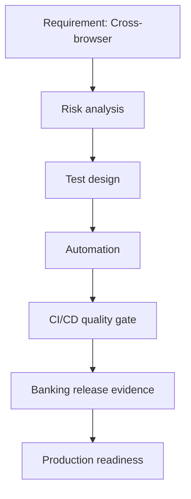

## RET-07122 — Inventory for Banking CI/CD quality gate adoption

- Domain: Banking
- Role: Lead Quality Engineer
- Difficulty: Hard
- Category: RETAIL_SUPPLY_CHAIN
- Concept: Inventory
- Quality score: 100/100

### Learning objective

Explain and defend a production-ready Inventory strategy for Banking as a Lead Quality Engineer.

### Model answer

I would start by clarifying the business workflow, data grain, upstream/downstream systems, and release risk for Inventory in a Banking account onboarding scenario. Because this is a hard Lead Quality Engineer interview problem, I would show lead-level ownership, cross-team coordination, automation strategy, risk-based prioritization, and release evidence.

My solution would focus on requirements clarity, risk-based testing, automation design, observability, evidence, and production readiness. I would define the acceptance criteria first, map them to testable controls, and separate validation into unit/component, API or integration, data, security, performance, and UAT evidence. For automation, I would create reusable checks that run in CI/CD, tag tests by risk and domain, and publish results with traceable evidence.

For production readiness, I would require clear pass/fail gates, defect triage rules, rollback criteria, monitoring dashboards, log/trace correlation, and sign-off from engineering, product, security, and business stakeholders where applicable. The key is not only proving that the happy path works, but proving that edge cases, failure behavior, auditability, and operational recovery are controlled.

### Validation strategy

- Clarify acceptance criteria and map each requirement to executable tests.
- Cover happy path, negative path, boundary conditions, failure modes, and regression impact.
- Automate repeatable checks and publish results as CI/CD quality-gate evidence.
- Validate observability with logs, metrics, traces, dashboards, and alert thresholds.
- Confirm release readiness with traceability, defect disposition, rollback criteria, and stakeholder sign-off.

### Evidence expected

- test plan
- automation results
- defect summary
- traceability matrix
- release sign-off

### Follow-up questions

- How would you automate this without making the suite brittle?
- What would you include in release-readiness evidence?
- How would you test failure behavior and recovery?
- Which risks would you escalate before go-live?
- How would you explain the result to a non-technical stakeholder?

### Whiteboard diagram

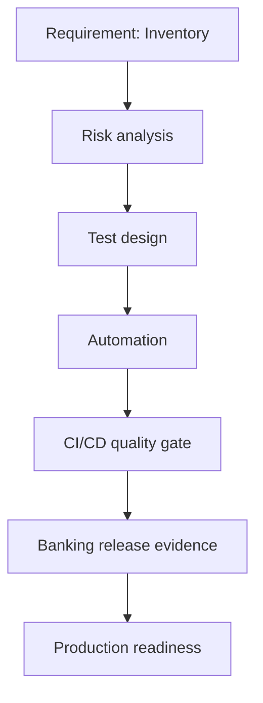

## PER-07556 — SLA validation for Banking API-first transformation

- Domain: Banking
- Role: Lead Quality Engineer
- Difficulty: Hard
- Category: PERFORMANCE_RELIABILITY
- Concept: SLA validation
- Quality score: 100/100

### Learning objective

Explain and defend a production-ready SLA validation strategy for Banking as a Lead Quality Engineer.

### Model answer

I would start by clarifying the business workflow, data grain, upstream/downstream systems, and release risk for SLA validation in a Banking account onboarding scenario. Because this is a hard Lead Quality Engineer interview problem, I would show lead-level ownership, cross-team coordination, automation strategy, risk-based prioritization, and release evidence.

My solution would focus on SLO/SLA definition, p95/p99 latency, throughput, error budget, saturation, resiliency, failover, and recovery. I would define the acceptance criteria first, map them to testable controls, and separate validation into unit/component, API or integration, data, security, performance, and UAT evidence. For automation, I would create reusable checks that run in CI/CD, tag tests by risk and domain, and publish results with traceable evidence.

For production readiness, I would require clear pass/fail gates, defect triage rules, rollback criteria, monitoring dashboards, log/trace correlation, and sign-off from engineering, product, security, and business stakeholders where applicable. The key is not only proving that the happy path works, but proving that edge cases, failure behavior, auditability, and operational recovery are controlled.

### Validation strategy

- Clarify acceptance criteria and map each requirement to executable tests.
- Cover happy path, negative path, boundary conditions, failure modes, and regression impact.
- Automate repeatable checks and publish results as CI/CD quality-gate evidence.
- Validate observability with logs, metrics, traces, dashboards, and alert thresholds.
- Confirm release readiness with traceability, defect disposition, rollback criteria, and stakeholder sign-off.

### Evidence expected

- load-test report
- latency percentiles
- throughput graph
- APM traces
- capacity recommendation

### Follow-up questions

- How would you automate this without making the suite brittle?
- What would you include in release-readiness evidence?
- How would you test failure behavior and recovery?
- Which risks would you escalate before go-live?
- How would you explain the result to a non-technical stakeholder?

### Whiteboard diagram


## ETL-07943 — PySpark for Banking data governance program

- Domain: Banking
- Role: Lead Quality Engineer
- Difficulty: Hard
- Category: DATA_ENGINEERING
- Concept: PySpark
- Quality score: 100/100

### Learning objective

Explain and defend a production-ready PySpark strategy for Banking as a Lead Quality Engineer.

### Model answer

I would start by clarifying the business workflow, data grain, upstream/downstream systems, and release risk for PySpark in a Banking account onboarding scenario. Because this is a hard Lead Quality Engineer interview problem, I would show lead-level ownership, cross-team coordination, automation strategy, risk-based prioritization, and release evidence.

My solution would focus on source-to-target validation, reconciliation, schema drift, data quality rules, lineage, and recoverability. I would define the acceptance criteria first, map them to testable controls, and separate validation into unit/component, API or integration, data, security, performance, and UAT evidence. For automation, I would create reusable checks that run in CI/CD, tag tests by risk and domain, and publish results with traceable evidence.

For production readiness, I would require clear pass/fail gates, defect triage rules, rollback criteria, monitoring dashboards, log/trace correlation, and sign-off from engineering, product, security, and business stakeholders where applicable. The key is not only proving that the happy path works, but proving that edge cases, failure behavior, auditability, and operational recovery are controlled.

### Validation strategy

- Clarify acceptance criteria and map each requirement to executable tests.
- Cover happy path, negative path, boundary conditions, failure modes, and regression impact.
- Automate repeatable checks and publish results as CI/CD quality-gate evidence.
- Validate observability with logs, metrics, traces, dashboards, and alert thresholds.
- Confirm release readiness with traceability, defect disposition, rollback criteria, and stakeholder sign-off.

### Evidence expected

- reconciliation report
- DQ rule results
- lineage proof
- exception queue
- rerun validation

### Follow-up questions

- How would you automate this without making the suite brittle?
- What would you include in release-readiness evidence?
- How would you test failure behavior and recovery?
- Which risks would you escalate before go-live?
- How would you explain the result to a non-technical stakeholder?

### Whiteboard diagram


## RET-08094 — WMS for Banking high-volume transaction validation

- Domain: Banking
- Role: Lead Quality Engineer
- Difficulty: Hard
- Category: RETAIL_SUPPLY_CHAIN
- Concept: WMS
- Quality score: 100/100

### Learning objective

Explain and defend a production-ready WMS strategy for Banking as a Lead Quality Engineer.

### Model answer

I would start by clarifying the business workflow, data grain, upstream/downstream systems, and release risk for WMS in a Banking account onboarding scenario. Because this is a hard Lead Quality Engineer interview problem, I would show lead-level ownership, cross-team coordination, automation strategy, risk-based prioritization, and release evidence.

My solution would focus on requirements clarity, risk-based testing, automation design, observability, evidence, and production readiness. I would define the acceptance criteria first, map them to testable controls, and separate validation into unit/component, API or integration, data, security, performance, and UAT evidence. For automation, I would create reusable checks that run in CI/CD, tag tests by risk and domain, and publish results with traceable evidence.

For production readiness, I would require clear pass/fail gates, defect triage rules, rollback criteria, monitoring dashboards, log/trace correlation, and sign-off from engineering, product, security, and business stakeholders where applicable. The key is not only proving that the happy path works, but proving that edge cases, failure behavior, auditability, and operational recovery are controlled.

### Validation strategy

- Clarify acceptance criteria and map each requirement to executable tests.
- Cover happy path, negative path, boundary conditions, failure modes, and regression impact.
- Automate repeatable checks and publish results as CI/CD quality-gate evidence.
- Validate observability with logs, metrics, traces, dashboards, and alert thresholds.
- Confirm release readiness with traceability, defect disposition, rollback criteria, and stakeholder sign-off.

### Evidence expected

- test plan
- automation results
- defect summary
- traceability matrix
- release sign-off

### Follow-up questions

- How would you automate this without making the suite brittle?
- What would you include in release-readiness evidence?
- How would you test failure behavior and recovery?
- Which risks would you escalate before go-live?
- How would you explain the result to a non-technical stakeholder?

### Whiteboard diagram


## SQL-08230 — Group By for Banking cloud migration

- Domain: Banking
- Role: Lead Quality Engineer
- Difficulty: Hard
- Category: DATA_ENGINEERING
- Concept: Group By
- Quality score: 100/100

### Learning objective

Explain and defend a production-ready Group By strategy for Banking as a Lead Quality Engineer.

### Model answer

I would start by clarifying the business workflow, data grain, upstream/downstream systems, and release risk for Group By in a Banking account onboarding scenario. Because this is a hard Lead Quality Engineer interview problem, I would show lead-level ownership, cross-team coordination, automation strategy, risk-based prioritization, and release evidence.

My solution would focus on source-to-target validation, reconciliation, schema drift, data quality rules, lineage, and recoverability. I would define the acceptance criteria first, map them to testable controls, and separate validation into unit/component, API or integration, data, security, performance, and UAT evidence. For automation, I would create reusable checks that run in CI/CD, tag tests by risk and domain, and publish results with traceable evidence.

For production readiness, I would require clear pass/fail gates, defect triage rules, rollback criteria, monitoring dashboards, log/trace correlation, and sign-off from engineering, product, security, and business stakeholders where applicable. The key is not only proving that the happy path works, but proving that edge cases, failure behavior, auditability, and operational recovery are controlled.

### Validation strategy

- Clarify acceptance criteria and map each requirement to executable tests.
- Cover happy path, negative path, boundary conditions, failure modes, and regression impact.
- Automate repeatable checks and publish results as CI/CD quality-gate evidence.
- Validate observability with logs, metrics, traces, dashboards, and alert thresholds.
- Confirm release readiness with traceability, defect disposition, rollback criteria, and stakeholder sign-off.

### Evidence expected

- reconciliation report
- DQ rule results
- lineage proof
- exception queue
- rerun validation

### Follow-up questions

- How would you automate this without making the suite brittle?
- What would you include in release-readiness evidence?
- How would you test failure behavior and recovery?
- Which risks would you escalate before go-live?
- How would you explain the result to a non-technical stakeholder?

### Whiteboard diagram

```mermaid
flowchart LR
  A[Source systems] --> B[Ingestion]
  B --> C[Validation rules]
  C --> D[Curated data]
  C --> E[Exception queue]
  D --> F[Analytics / downstream APIs]
  C --> G[Quality evidence]
```

## JAV-08426 — Anagram detection for Banking data governance program

- Domain: Banking
- Role: Lead Quality Engineer
- Difficulty: Hard
- Category: JAVA_STRINGS
- Concept: Anagram detection
- Quality score: 100/100

### Learning objective

Explain and defend a production-ready Anagram detection strategy for Banking as a Lead Quality Engineer.

### Model answer

I would start by clarifying the business workflow, data grain, upstream/downstream systems, and release risk for Anagram detection in a Banking account onboarding scenario. Because this is a hard Lead Quality Engineer interview problem, I would show lead-level ownership, cross-team coordination, automation strategy, risk-based prioritization, and release evidence.

My solution would focus on input normalization, null safety, encoding, validation rules, boundary tests, internationalization, and maintainable utilities. I would define the acceptance criteria first, map them to testable controls, and separate validation into unit/component, API or integration, data, security, performance, and UAT evidence. For automation, I would create reusable checks that run in CI/CD, tag tests by risk and domain, and publish results with traceable evidence.

For production readiness, I would require clear pass/fail gates, defect triage rules, rollback criteria, monitoring dashboards, log/trace correlation, and sign-off from engineering, product, security, and business stakeholders where applicable. The key is not only proving that the happy path works, but proving that edge cases, failure behavior, auditability, and operational recovery are controlled.

### Validation strategy

- Clarify acceptance criteria and map each requirement to executable tests.
- Cover happy path, negative path, boundary conditions, failure modes, and regression impact.
- Automate repeatable checks and publish results as CI/CD quality-gate evidence.
- Validate observability with logs, metrics, traces, dashboards, and alert thresholds.
- Confirm release readiness with traceability, defect disposition, rollback criteria, and stakeholder sign-off.

### Evidence expected

- unit-test matrix
- boundary cases
- code coverage
- static analysis
- complexity notes

### Follow-up questions

- How would you automate this without making the suite brittle?
- What would you include in release-readiness evidence?
- How would you test failure behavior and recovery?
- Which risks would you escalate before go-live?
- How would you explain the result to a non-technical stakeholder?

### Whiteboard diagram

```mermaid
flowchart TD
  A[Requirement: Anagram detection] --> B[Risk analysis]
  B --> C[Test design]
  C --> D[Automation]
  D --> E[CI/CD quality gate]
  E --> F[Banking release evidence]
  F --> G[Production readiness]
```

## SEC-08691 — PHI for Banking data governance program

- Domain: Banking
- Role: Lead Quality Engineer
- Difficulty: Hard
- Category: SECURITY_PRIVACY
- Concept: PHI
- Quality score: 100/100

### Learning objective

Explain and defend a production-ready PHI strategy for Banking as a Lead Quality Engineer.

### Model answer

I would start by clarifying the business workflow, data grain, upstream/downstream systems, and release risk for PHI in a Banking account onboarding scenario. Because this is a hard Lead Quality Engineer interview problem, I would show lead-level ownership, cross-team coordination, automation strategy, risk-based prioritization, and release evidence.

My solution would focus on data protection, least privilege, auditability, masking, encryption, retention, consent, and regulatory evidence. I would define the acceptance criteria first, map them to testable controls, and separate validation into unit/component, API or integration, data, security, performance, and UAT evidence. For automation, I would create reusable checks that run in CI/CD, tag tests by risk and domain, and publish results with traceable evidence.

For production readiness, I would require clear pass/fail gates, defect triage rules, rollback criteria, monitoring dashboards, log/trace correlation, and sign-off from engineering, product, security, and business stakeholders where applicable. The key is not only proving that the happy path works, but proving that edge cases, failure behavior, auditability, and operational recovery are controlled.

### Validation strategy

- Clarify acceptance criteria and map each requirement to executable tests.
- Cover happy path, negative path, boundary conditions, failure modes, and regression impact.
- Automate repeatable checks and publish results as CI/CD quality-gate evidence.
- Validate observability with logs, metrics, traces, dashboards, and alert thresholds.
- Confirm release readiness with traceability, defect disposition, rollback criteria, and stakeholder sign-off.

### Evidence expected

- masked data screenshots
- access-control matrix
- audit log samples
- negative authorization tests
- encryption validation evidence

### Follow-up questions

- How would you automate this without making the suite brittle?
- What would you include in release-readiness evidence?
- How would you test failure behavior and recovery?
- Which risks would you escalate before go-live?
- How would you explain the result to a non-technical stakeholder?

### Whiteboard diagram

```mermaid
flowchart TD
  A[Requirement: PHI] --> B[Risk analysis]
  B --> C[Test design]
  C --> D[Automation]
  D --> E[CI/CD quality gate]
  E --> F[Banking release evidence]
  F --> G[Production readiness]
```

## CI_-08865 — Quality gates for Banking data platform migration

- Domain: Banking
- Role: Lead Quality Engineer
- Difficulty: Hard
- Category: CI_CD_DEVOPS
- Concept: Quality gates
- Quality score: 100/100

### Learning objective

Explain and defend a production-ready Quality gates strategy for Banking as a Lead Quality Engineer.

### Model answer

I would start by clarifying the business workflow, data grain, upstream/downstream systems, and release risk for Quality gates in a Banking account onboarding scenario. Because this is a hard Lead Quality Engineer interview problem, I would show lead-level ownership, cross-team coordination, automation strategy, risk-based prioritization, and release evidence.

My solution would focus on requirements clarity, risk-based testing, automation design, observability, evidence, and production readiness. I would define the acceptance criteria first, map them to testable controls, and separate validation into unit/component, API or integration, data, security, performance, and UAT evidence. For automation, I would create reusable checks that run in CI/CD, tag tests by risk and domain, and publish results with traceable evidence.

For production readiness, I would require clear pass/fail gates, defect triage rules, rollback criteria, monitoring dashboards, log/trace correlation, and sign-off from engineering, product, security, and business stakeholders where applicable. The key is not only proving that the happy path works, but proving that edge cases, failure behavior, auditability, and operational recovery are controlled.

### Validation strategy

- Clarify acceptance criteria and map each requirement to executable tests.
- Cover happy path, negative path, boundary conditions, failure modes, and regression impact.
- Automate repeatable checks and publish results as CI/CD quality-gate evidence.
- Validate observability with logs, metrics, traces, dashboards, and alert thresholds.
- Confirm release readiness with traceability, defect disposition, rollback criteria, and stakeholder sign-off.

### Evidence expected

- test plan
- automation results
- defect summary
- traceability matrix
- release sign-off

### Follow-up questions

- How would you automate this without making the suite brittle?
- What would you include in release-readiness evidence?
- How would you test failure behavior and recovery?
- Which risks would you escalate before go-live?
- How would you explain the result to a non-technical stakeholder?

### Whiteboard diagram

```mermaid
flowchart TD
  A[Requirement: Quality gates] --> B[Risk analysis]
  B --> C[Test design]
  C --> D[Automation]
  D --> E[CI/CD quality gate]
  E --> F[Banking release evidence]
  F --> G[Production readiness]
```

## JAV-08893 — LinkedHashMap for Banking enterprise modernization

- Domain: Banking
- Role: Lead Quality Engineer
- Difficulty: Hard
- Category: JAVA_STRINGS
- Concept: LinkedHashMap
- Quality score: 100/100

### Learning objective

Explain and defend a production-ready LinkedHashMap strategy for Banking as a Lead Quality Engineer.

### Model answer

I would start by clarifying the business workflow, data grain, upstream/downstream systems, and release risk for LinkedHashMap in a Banking account onboarding scenario. Because this is a hard Lead Quality Engineer interview problem, I would show lead-level ownership, cross-team coordination, automation strategy, risk-based prioritization, and release evidence.

My solution would focus on input normalization, null safety, encoding, validation rules, boundary tests, internationalization, and maintainable utilities. I would define the acceptance criteria first, map them to testable controls, and separate validation into unit/component, API or integration, data, security, performance, and UAT evidence. For automation, I would create reusable checks that run in CI/CD, tag tests by risk and domain, and publish results with traceable evidence.

For production readiness, I would require clear pass/fail gates, defect triage rules, rollback criteria, monitoring dashboards, log/trace correlation, and sign-off from engineering, product, security, and business stakeholders where applicable. The key is not only proving that the happy path works, but proving that edge cases, failure behavior, auditability, and operational recovery are controlled.

### Validation strategy

- Clarify acceptance criteria and map each requirement to executable tests.
- Cover happy path, negative path, boundary conditions, failure modes, and regression impact.
- Automate repeatable checks and publish results as CI/CD quality-gate evidence.
- Validate observability with logs, metrics, traces, dashboards, and alert thresholds.
- Confirm release readiness with traceability, defect disposition, rollback criteria, and stakeholder sign-off.

### Evidence expected

- unit-test matrix
- boundary cases
- code coverage
- static analysis
- complexity notes

### Follow-up questions

- How would you automate this without making the suite brittle?
- What would you include in release-readiness evidence?
- How would you test failure behavior and recovery?
- Which risks would you escalate before go-live?
- How would you explain the result to a non-technical stakeholder?

### Whiteboard diagram

```mermaid
flowchart TD
  A[Requirement: LinkedHashMap] --> B[Risk analysis]
  B --> C[Test design]
  C --> D[Automation]
  D --> E[CI/CD quality gate]
  E --> F[Banking release evidence]
  F --> G[Production readiness]
```

## FRA-08990 — Reporting for Banking observability and production readiness

- Domain: Banking
- Role: Lead Quality Engineer
- Difficulty: Hard
- Category: FRAMEWORK_ARCHITECTURE
- Concept: Reporting
- Quality score: 100/100

### Learning objective

Explain and defend a production-ready Reporting strategy for Banking as a Lead Quality Engineer.

### Model answer

I would start by clarifying the business workflow, data grain, upstream/downstream systems, and release risk for Reporting in a Banking account onboarding scenario. Because this is a hard Lead Quality Engineer interview problem, I would show lead-level ownership, cross-team coordination, automation strategy, risk-based prioritization, and release evidence.

My solution would focus on requirements clarity, risk-based testing, automation design, observability, evidence, and production readiness. I would define the acceptance criteria first, map them to testable controls, and separate validation into unit/component, API or integration, data, security, performance, and UAT evidence. For automation, I would create reusable checks that run in CI/CD, tag tests by risk and domain, and publish results with traceable evidence.

For production readiness, I would require clear pass/fail gates, defect triage rules, rollback criteria, monitoring dashboards, log/trace correlation, and sign-off from engineering, product, security, and business stakeholders where applicable. The key is not only proving that the happy path works, but proving that edge cases, failure behavior, auditability, and operational recovery are controlled.

### Validation strategy

- Clarify acceptance criteria and map each requirement to executable tests.
- Cover happy path, negative path, boundary conditions, failure modes, and regression impact.
- Automate repeatable checks and publish results as CI/CD quality-gate evidence.
- Validate observability with logs, metrics, traces, dashboards, and alert thresholds.
- Confirm release readiness with traceability, defect disposition, rollback criteria, and stakeholder sign-off.

### Evidence expected

- test plan
- automation results
- defect summary
- traceability matrix
- release sign-off

### Follow-up questions

- How would you automate this without making the suite brittle?
- What would you include in release-readiness evidence?
- How would you test failure behavior and recovery?
- Which risks would you escalate before go-live?
- How would you explain the result to a non-technical stakeholder?

### Whiteboard diagram

```mermaid
flowchart TD
  A[Requirement: Reporting] --> B[Risk analysis]
  B --> C[Test design]
  C --> D[Automation]
  D --> E[CI/CD quality gate]
  E --> F[Banking release evidence]
  F --> G[Production readiness]
```

## JAV-09254 — Normalization for Banking CI/CD quality gate adoption

- Domain: Banking
- Role: Lead Quality Engineer
- Difficulty: Hard
- Category: JAVA_STRINGS
- Concept: Normalization
- Quality score: 100/100

### Learning objective

Explain and defend a production-ready Normalization strategy for Banking as a Lead Quality Engineer.

### Model answer

I would start by clarifying the business workflow, data grain, upstream/downstream systems, and release risk for Normalization in a Banking account onboarding scenario. Because this is a hard Lead Quality Engineer interview problem, I would show lead-level ownership, cross-team coordination, automation strategy, risk-based prioritization, and release evidence.

My solution would focus on input normalization, null safety, encoding, validation rules, boundary tests, internationalization, and maintainable utilities. I would define the acceptance criteria first, map them to testable controls, and separate validation into unit/component, API or integration, data, security, performance, and UAT evidence. For automation, I would create reusable checks that run in CI/CD, tag tests by risk and domain, and publish results with traceable evidence.

For production readiness, I would require clear pass/fail gates, defect triage rules, rollback criteria, monitoring dashboards, log/trace correlation, and sign-off from engineering, product, security, and business stakeholders where applicable. The key is not only proving that the happy path works, but proving that edge cases, failure behavior, auditability, and operational recovery are controlled.

### Validation strategy

- Clarify acceptance criteria and map each requirement to executable tests.
- Cover happy path, negative path, boundary conditions, failure modes, and regression impact.
- Automate repeatable checks and publish results as CI/CD quality-gate evidence.
- Validate observability with logs, metrics, traces, dashboards, and alert thresholds.
- Confirm release readiness with traceability, defect disposition, rollback criteria, and stakeholder sign-off.

### Evidence expected

- unit-test matrix
- boundary cases
- code coverage
- static analysis
- complexity notes

### Follow-up questions

- How would you automate this without making the suite brittle?
- What would you include in release-readiness evidence?
- How would you test failure behavior and recovery?
- Which risks would you escalate before go-live?
- How would you explain the result to a non-technical stakeholder?

### Whiteboard diagram

```mermaid
flowchart TD
  A[Requirement: Normalization] --> B[Risk analysis]
  B --> C[Test design]
  C --> D[Automation]
  D --> E[CI/CD quality gate]
  E --> F[Banking release evidence]
  F --> G[Production readiness]
```

## UI_-09475 — POM for Banking API-first transformation

- Domain: Banking
- Role: Lead Quality Engineer
- Difficulty: Hard
- Category: UI_AUTOMATION
- Concept: POM
- Quality score: 100/100

### Learning objective

Explain and defend a production-ready POM strategy for Banking as a Lead Quality Engineer.

### Model answer

I would start by clarifying the business workflow, data grain, upstream/downstream systems, and release risk for POM in a Banking account onboarding scenario. Because this is a hard Lead Quality Engineer interview problem, I would show lead-level ownership, cross-team coordination, automation strategy, risk-based prioritization, and release evidence.

My solution would focus on requirements clarity, risk-based testing, automation design, observability, evidence, and production readiness. I would define the acceptance criteria first, map them to testable controls, and separate validation into unit/component, API or integration, data, security, performance, and UAT evidence. For automation, I would create reusable checks that run in CI/CD, tag tests by risk and domain, and publish results with traceable evidence.

For production readiness, I would require clear pass/fail gates, defect triage rules, rollback criteria, monitoring dashboards, log/trace correlation, and sign-off from engineering, product, security, and business stakeholders where applicable. The key is not only proving that the happy path works, but proving that edge cases, failure behavior, auditability, and operational recovery are controlled.

### Validation strategy

- Clarify acceptance criteria and map each requirement to executable tests.
- Cover happy path, negative path, boundary conditions, failure modes, and regression impact.
- Automate repeatable checks and publish results as CI/CD quality-gate evidence.
- Validate observability with logs, metrics, traces, dashboards, and alert thresholds.
- Confirm release readiness with traceability, defect disposition, rollback criteria, and stakeholder sign-off.

### Evidence expected

- test plan
- automation results
- defect summary
- traceability matrix
- release sign-off

### Follow-up questions

- How would you automate this without making the suite brittle?
- What would you include in release-readiness evidence?
- How would you test failure behavior and recovery?
- Which risks would you escalate before go-live?
- How would you explain the result to a non-technical stakeholder?

### Whiteboard diagram

```mermaid
flowchart TD
  A[Requirement: POM] --> B[Risk analysis]
  B --> C[Test design]
  C --> D[Automation]
  D --> E[CI/CD quality gate]
  E --> F[Banking release evidence]
  F --> G[Production readiness]
```
